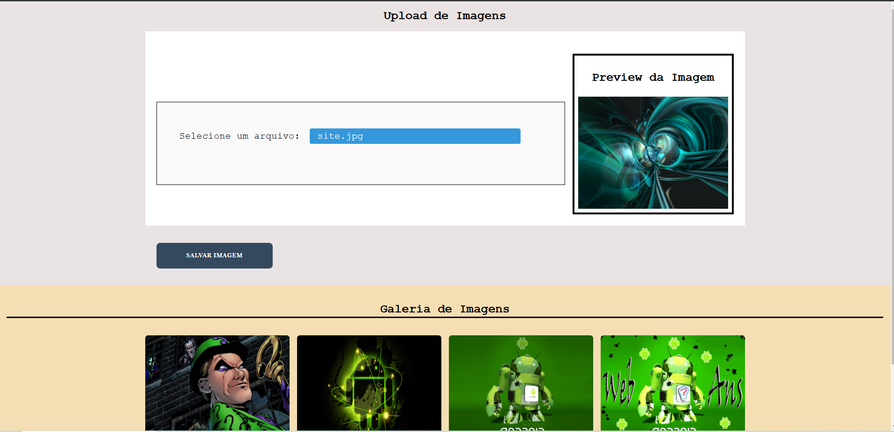

# Resumo do projeto
- Nesse projeto foi criado uma funcionalidade para fazer um upload de imagens e mostrar em uma galeria de imagens. 

## Tecnologias usadas
- HTML
- CSS
- Javascript

### Funcionalidades
- Fazer um upload de imagens [x]
- Ver um preview da imagem [x]
- Salvar a imagem em uma pasta no proprio projeto [x]
- Mostrar a imagem em uma galeria [x]
- Recarregar as imagens na galeria [x]
- Apos cadastrar uma imagem limpar a seção de imagem e o preview criado [x]

